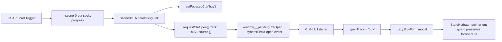

# ADR-FR-SCENE-011: Scene 0 CTA Opens The Existing CTA Hub Modal

Date: 2026-05-18

Status: accepted, self-approved

## Context

FR-SCENE-011 requires a first-viewport "Book a Discovery Call" CTA and a sticky scroll variant that open the same Buy modal owned by FR-CTA-001. The existing modal state is intentionally local to `CtaHub`, while Scene 0 lives earlier in the DOM. Reaching into `CtaHub` internals or duplicating modal state would violate the FR-CTA-001 DOM/modal contract.

## Decision

Add a tiny typed browser event bridge in `apps/web/components/cta/cta-events.ts`. Scene 0 requests a CTA open with `requestCtaOpen({ track: 'buy', source })`; `CtaHub` listens for that event, consumes any pending request, and opens its existing lazy Buy form. Scene 0 also sets `focusedCta` immediately so Lumi/store observers see the user intent without waiting for the hub listener.

The sticky transition is owned by `Scene0CTA.client.tsx`, using client-only GSAP ScrollTrigger setup and CSS custom properties for a token-derived 200ms ease-genie crossfade.

## Consequences

- Scene 0 can open the real FR-CTA-001 Buy modal without a second modal implementation.
- No Three/R3F or Drei `<Html>` CTA path is introduced.
- `StoreHydrator` now avoids clearing `focusedCta` on pointer-out while a CTA modal is open, keeping click-open state stable.
- The event bridge records `window.__ctaOpenEvents` for browser debugging and Playwright verification.

## Data Flow

## Verification

- `apps/web/components/scenes/scene-0-hero/__tests__/scene-0-cta.unit.test.tsx`
- `apps/web/components/cta/__tests__/cta-open-events.unit.test.tsx`
- `apps/web/tests/web/scene-0-cta.spec.ts`
