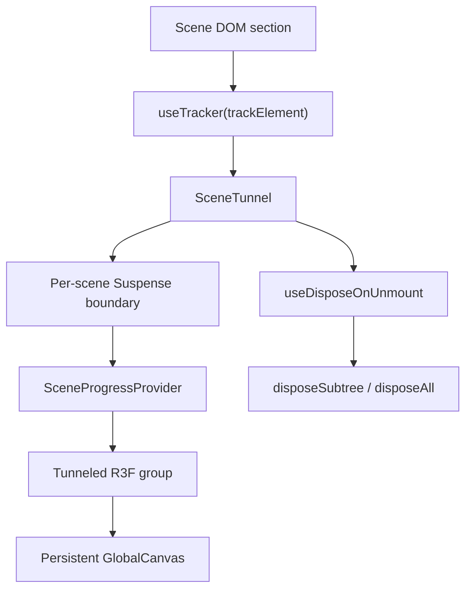

# ADR-FR-WEB-003 — SceneTunnel Owns Per-Scene Suspense

Status: accepted

Date: 2026-05-18

## Context

FR-WEB-003 originally prohibited Suspense inside `SceneTunnel` so the tunneling primitive stayed synchronous. FR-WEB-006 later required one Suspense boundary per scene, inside the tunneled canvas subtree, so a stalled scene asset cannot suspend the persistent `GlobalCanvas` or Lumi.

## Decision

`SceneTunnel` owns a per-scene Suspense boundary with `SceneSuspenseFallback`. The prohibition is narrowed to whole-canvas Suspense and arbitrary scene-authored Suspense wrappers. This keeps the canvas alive, keeps loading UI consistent, and gives every tunneled subtree the same disposal and progress context.

## Consequences

- `GlobalCanvas` remains synchronous and persistent.
- Scene authors mount R3F children through `SceneTunnel` and do not add their own canvas or Suspense boundary.
- FR-WEB-006 preload/fallback behavior can be validated through one canonical component.
- Strict audit treats the FR-WEB-003 §1 #16 original ban as superseded by this ADR and FR-WEB-006.

## Data Flow

