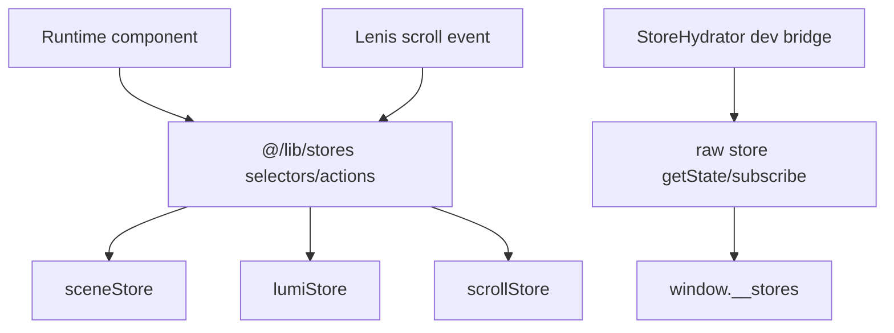

# ADR-FR-WEB-004 — Store Barrel Is the Runtime Contract

Status: accepted

Date: 2026-05-18

## Context

FR-WEB-004 defines Zustand stores for scene, Lumi, and scroll state. The strict audit found ordinary runtime components importing individual store modules for discrete-event writes. That works technically, but it weakens the selector/action barrel contract and makes future render-loop guardrails harder to enforce.

## Decision

Runtime app code imports typed selectors and action accessors from `@/lib/stores`. Direct imports from `sceneStore`, `lumiStore`, and `scrollStore` are reserved for store implementation, unit tests, and the development-only `StoreHydrator` bridge that publishes `window.__stores`.

## Consequences

- Scene and CTA components subscribe through typed selectors or call explicit action accessors.
- Discrete-event writes remain allowed; store writes inside `useFrame` remain forbidden.
- Debug/test code can still inspect raw Zustand stores without leaking that pattern into feature code.
- Guardrail tests enforce the import boundary.

## Data Flow

