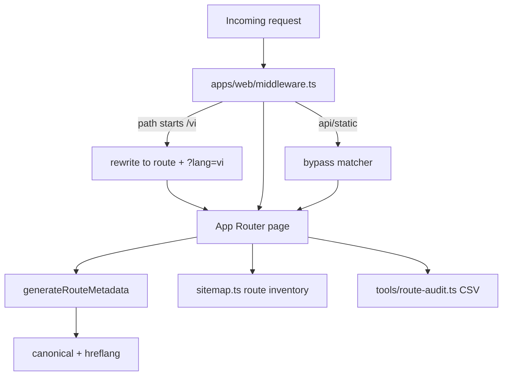

# ADR-FR-WEB-008 — Expanded App Router Surface

Status: accepted
Date: 2026-05-18

## Context

FR-WEB-008 originally expected four public routes, three API/query-param surfaces, and no middleware. Later shipped FRs added `/vi/*`, `/work`, `/capabilities`, `/team`, `/careers`, draft/revalidate/jobs APIs, and app-local locale middleware.

## Decision

Accept the expanded App Router surface as the current implementation contract. Guardrails remain App Router only, typed routes, helper-generated canonical/hreflang output, sanctioned product/ops APIs, and app-local locale middleware.

## Consequences

- The no-middleware clause is superseded by app-local locale middleware.
- `/lite` keeps canonical `/` while localized public routes receive their own `vi` alternate.
- `tools/route-audit.ts` is the observability hook for canonical, hreflang, and sitemap drift.
- New API routes require a matching FR and route-audit/guardrail update before shipping.

Self-approval: Principal Engineer zero-touch execution approved this deviation after strict routing, SEO, and Playwright validation passed.
