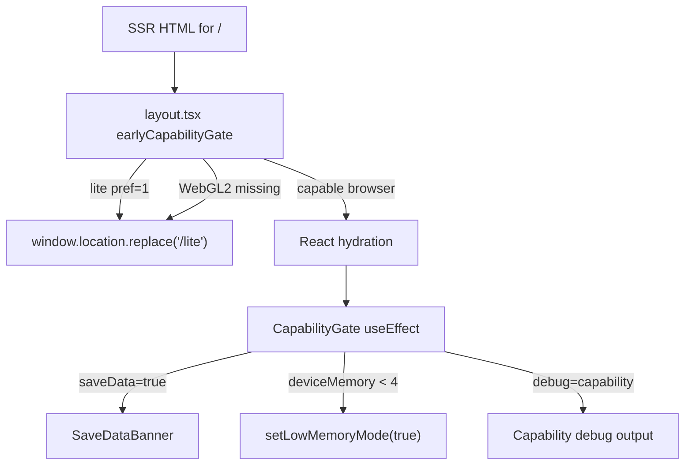

# ADR-FR-WEB-009 — Pre-hydration No-WebGL Lite Gate

Status: accepted
Date: 2026-05-18

## Context

FR-WEB-009 requires client-only capability detection and a `/lite` redirect within 500 ms when WebGL2 is missing or a returning user has selected lite mode. A pure React `useEffect` gate is architecturally clean but can run after hydration work, which increases the risk of a visible canvas flash on incapable devices.

## Decision

Keep `CapabilityGate` as the canonical React owner for save-data banners, low-memory Zustand state, debug output, and analytics. Add a narrow pre-hydration inline script in `apps/web/app/layout.tsx` for only two deterministic redirect cases: `cyberskill_lite_pref === "1"` and missing WebGL2/float-color support.

## Consequences

- SSR output remains cinematic and crawlable; the script does not alter server-rendered HTML.
- There is still no middleware or user-agent sniffing redirect.
- Save-data and low-memory detection remain in React because they need UI/state side effects.
- Redirect-latency observability is stored in `sessionStorage.cyberskill_lite_redirect_ms`, with Playwright asserting the value is at or below 500 ms.

Self-approval: Principal Engineer zero-touch execution approved this deviation because it reduces black-canvas flash risk while preserving the client-only detection boundary.
