# FR Dependency Graph

> **Generated.** Run `python3 tools/fr-graph.py` to regenerate. Do NOT hand-edit.

**Inventory:** 125 FRs · 198 dependency edges

✅ **No cycles.** The graph is a clean DAG.

## Most-blocking FRs (top 10)

These FRs unblock the largest number of downstream tasks. Prioritise them at slice-planning time.

| Rank | FR-ID | Module | Phase | Status | Downstream count |
|---:|---|:-:|:-:|:-:|---:|
| 1 | [FR-CHAR-001](char/FR-CHAR-001-lumi-2d-character-sheet.md) | CHAR | P0 | shipped | 102 |
| 2 | [FR-DS-001](ds/FR-DS-001-mood-board.md) | DS | P0 | shipped | 90 |
| 3 | [FR-DS-002](ds/FR-DS-002-palette-swatch-wcag-matrix.md) | DS | P0 | shipped | 89 |
| 4 | [FR-DS-003](ds/FR-DS-003-cinematic-pack-skeleton.md) | DS | P1 | accepted | 79 |
| 5 | [FR-WEB-001](web/FR-WEB-001-next15-r3f-globalcanvas-bootstrap.md) | WEB | P3 | accepted | 60 |
| 6 | [FR-CMS-001](cms/FR-CMS-001-master-narrative-arc.md) | CMS | P0 | shipped | 38 |
| 7 | [FR-CMS-002](cms/FR-CMS-002-per-scene-narration.md) | CMS | P0 | shipped | 37 |
| 8 | [FR-CHAR-002](char/FR-CHAR-002-silhouette-test.md) | CHAR | P0 | shipped | 35 |
| 9 | [FR-CHAR-004](char/FR-CHAR-004-lumi-greybox.md) | CHAR | P1 | accepted | 34 |
| 10 | [FR-CHAR-006](char/FR-CHAR-006-production-mesh.md) | CHAR | P2 | accepted | 32 |

## Full graph

```mermaid
flowchart LR

  subgraph P0[P0]
    FR_CHAR_001[⚓ FR-CHAR-001]
    FR_CHAR_002[⚓ FR-CHAR-002]
    FR_CHAR_003[⚓ FR-CHAR-003]
    FR_CMS_001[⚓ FR-CMS-001]
    FR_CMS_002[⚓ FR-CMS-002]
    FR_CMS_003[⚓ FR-CMS-003]
    FR_DS_001[⚓ FR-DS-001]
    FR_DS_002[⚓ FR-DS-002]
  end

  subgraph P1[P1]
    FR_CHAR_004[⚓ FR-CHAR-004]
    FR_CHAR_005[⚓ FR-CHAR-005]
    FR_DS_003[⚓ FR-DS-003]
    FR_DS_004[⚓ FR-DS-004]
    FR_DS_005[⚓ FR-DS-005]
    FR_DS_006[⚓ FR-DS-006]
    FR_DS_007[⚓ FR-DS-007]
    FR_DS_008[⚓ FR-DS-008]
    FR_DS_009[⚓ FR-DS-009]
    FR_SCENE_001[⚓ FR-SCENE-001]
    FR_SCENE_002[⚓ FR-SCENE-002]
    FR_SCENE_003[⚓ FR-SCENE-003]
    FR_SCENE_004[⚓ FR-SCENE-004]
    FR_SCENE_005[⚓ FR-SCENE-005]
    FR_SCENE_006[⚓ FR-SCENE-006]
    FR_SCENE_007[⚓ FR-SCENE-007]
    FR_SCENE_008[⚓ FR-SCENE-008]
  end

  subgraph P2[P2]
    FR_CHAR_006[⚓ FR-CHAR-006]
    FR_CHAR_007[⚓ FR-CHAR-007]
    FR_CHAR_008[⚓ FR-CHAR-008]
    FR_CHAR_009[⚓ FR-CHAR-009]
    FR_CHAR_010[⚓ FR-CHAR-010]
    FR_CHAR_011[⚓ FR-CHAR-011]
    FR_CHAR_012[⚓ FR-CHAR-012]
    FR_OPS_001[⚓ FR-OPS-001]
    FR_OPS_002[⚓ FR-OPS-002]
    FR_OPS_003[⚓ FR-OPS-003]
    FR_OPS_004[⚓ FR-OPS-004]
    FR_OPS_005[⚓ FR-OPS-005]
    FR_OPS_006[⚓ FR-OPS-006]
    FR_OPS_007[⚓ FR-OPS-007]
    FR_OPS_008[⚓ FR-OPS-008]
    FR_OPS_009[⚓ FR-OPS-009]
  end

  subgraph P3[P3]
    FR_A11Y_001[⚓ FR-A11Y-001]
    FR_A11Y_002[⚓ FR-A11Y-002]
    FR_A11Y_003[⚓ FR-A11Y-003]
    FR_A11Y_004[⚓ FR-A11Y-004]
    FR_A11Y_005[⚓ FR-A11Y-005]
    FR_OPS_010[⚓ FR-OPS-010]
    FR_OPS_011[⚓ FR-OPS-011]
    FR_OPS_012[⚓ FR-OPS-012]
    FR_OPS_013[⚓ FR-OPS-013]
    FR_SCENE_009[⚓ FR-SCENE-009]
    FR_SCENE_010[⚓ FR-SCENE-010]
    FR_SCENE_011[⚓ FR-SCENE-011]
    FR_SCENE_012[⚓ FR-SCENE-012]
    FR_WEB_001[⚓ FR-WEB-001]
    FR_WEB_002[⚓ FR-WEB-002]
    FR_WEB_003[⚓ FR-WEB-003]
    FR_WEB_004[⚓ FR-WEB-004]
    FR_WEB_005[⚓ FR-WEB-005]
    FR_WEB_006[⚓ FR-WEB-006]
    FR_WEB_007[⚓ FR-WEB-007]
    FR_WEB_008[⚓ FR-WEB-008]
    FR_WEB_009[⚓ FR-WEB-009]
  end

  subgraph P4[P4]
    FR_CMS_004[FR-CMS-004]
    FR_CMS_005[FR-CMS-005]
    FR_CMS_006[FR-CMS-006]
    FR_CMS_007[FR-CMS-007]
    FR_CMS_008[FR-CMS-008]
    FR_CTA_001[⚓ FR-CTA-001]
    FR_CTA_002[⚓ FR-CTA-002]
    FR_CTA_003[FR-CTA-003]
    FR_CTA_004[FR-CTA-004]
    FR_CTA_005[FR-CTA-005]
    FR_CTA_006[FR-CTA-006]
    FR_CTA_007[FR-CTA-007]
    FR_CTA_008[FR-CTA-008]
    FR_SCENE_013[⚓ FR-SCENE-013]
    FR_SCENE_014[⚓ FR-SCENE-014]
    FR_SCENE_015[⚓ FR-SCENE-015]
    FR_SCENE_016[⚓ FR-SCENE-016]
    FR_SCENE_017[⚓ FR-SCENE-017]
    FR_SCENE_018[⚓ FR-SCENE-018]
    FR_SCENE_019[⚓ FR-SCENE-019]
    FR_SCENE_020[⚓ FR-SCENE-020]
    FR_SCENE_021[⚓ FR-SCENE-021]
    FR_SCENE_022[⚓ FR-SCENE-022]
    FR_SCENE_023[⚓ FR-SCENE-023]
    FR_SCENE_024[⚓ FR-SCENE-024]
  end

  subgraph P5[P5]
    FR_A11Y_006[FR-A11Y-006]
    FR_A11Y_007[FR-A11Y-007]
    FR_A11Y_008[FR-A11Y-008]
    FR_A11Y_009[FR-A11Y-009]
    FR_A11Y_010[FR-A11Y-010]
    FR_A11Y_011[FR-A11Y-011]
    FR_A11Y_012[FR-A11Y-012]
    FR_CMS_009[FR-CMS-009]
    FR_CMS_010[FR-CMS-010]
    FR_PERF_001[⚓ FR-PERF-001]
    FR_PERF_002[FR-PERF-002]
    FR_PERF_003[FR-PERF-003]
    FR_PERF_004[FR-PERF-004]
    FR_PERF_005[FR-PERF-005]
    FR_PERF_006[FR-PERF-006]
    FR_PERF_007[FR-PERF-007]
    FR_PERF_008[FR-PERF-008]
    FR_PERF_009[FR-PERF-009]
    FR_PERF_010[FR-PERF-010]
    FR_SEO_001[⚓ FR-SEO-001]
    FR_SEO_002[FR-SEO-002]
    FR_SEO_003[FR-SEO-003]
    FR_SEO_004[FR-SEO-004]
    FR_SEO_005[FR-SEO-005]
    FR_SEO_006[FR-SEO-006]
  end

  subgraph P6[P6]
    FR_A11Y_013[FR-A11Y-013]
    FR_CMS_011[FR-CMS-011]
    FR_CTA_009[FR-CTA-009]
    FR_CTA_010[FR-CTA-010]
    FR_CTA_011[FR-CTA-011]
    FR_OPS_014[FR-OPS-014]
    FR_OPS_015[FR-OPS-015]
    FR_OPS_016[FR-OPS-016]
    FR_PERF_011[FR-PERF-011]
    FR_SEO_007[FR-SEO-007]
    FR_SEO_008[FR-SEO-008]
    FR_SEO_009[FR-SEO-009]
  end

  FR_WEB_008 --> FR_A11Y_001
  FR_SCENE_009 --> FR_A11Y_002
  FR_WEB_001 --> FR_A11Y_003
  FR_WEB_001 --> FR_A11Y_004
  FR_WEB_009 --> FR_A11Y_005
  FR_CMS_002 --> FR_A11Y_006
  FR_SCENE_020 --> FR_A11Y_006
  FR_DS_003 --> FR_A11Y_008
  FR_CTA_001 --> FR_A11Y_009
  FR_CTA_005 --> FR_A11Y_010
  FR_WEB_008 --> FR_A11Y_011
  FR_CHAR_001 --> FR_CHAR_002
  FR_CHAR_001 --> FR_CHAR_003
  FR_CHAR_001 --> FR_CHAR_004
  FR_CHAR_002 --> FR_CHAR_004
  FR_CHAR_004 --> FR_CHAR_005
  FR_SCENE_008 --> FR_CHAR_005
  FR_CHAR_001 --> FR_CHAR_006
  FR_CHAR_004 --> FR_CHAR_006
  FR_CHAR_006 --> FR_CHAR_007
  FR_CHAR_006 --> FR_CHAR_008
  FR_CHAR_007 --> FR_CHAR_008
  FR_OPS_001 --> FR_CHAR_008
  FR_CHAR_006 --> FR_CHAR_009
  FR_CHAR_009 --> FR_CHAR_010
  FR_CHAR_009 --> FR_CHAR_011
  FR_CHAR_010 --> FR_CHAR_011
  FR_CHAR_003 --> FR_CHAR_012
  FR_CHAR_009 --> FR_CHAR_012
  FR_CMS_001 --> FR_CMS_002
  FR_CMS_002 --> FR_CMS_003
  FR_CMS_004 --> FR_CMS_005
  FR_CMS_005 --> FR_CMS_006
  FR_WEB_008 --> FR_CMS_006
  FR_CMS_003 --> FR_CMS_007
  FR_CMS_007 --> FR_CMS_008
  FR_CMS_003 --> FR_CMS_009
  FR_CMS_007 --> FR_CMS_010
  FR_CMS_006 --> FR_CMS_011
  FR_DS_003 --> FR_CTA_001
  FR_CTA_001 --> FR_CTA_002
  FR_CTA_005 --> FR_CTA_002
  FR_CTA_001 --> FR_CTA_003
  FR_CTA_005 --> FR_CTA_003
  FR_CTA_006 --> FR_CTA_003
  FR_CTA_001 --> FR_CTA_004
  FR_CTA_005 --> FR_CTA_004
  FR_CTA_006 --> FR_CTA_004
  FR_CTA_001 --> FR_CTA_005
  FR_CTA_005 --> FR_CTA_006
  FR_CTA_002 --> FR_CTA_007
  FR_CHAR_011 --> FR_CTA_007
  FR_SCENE_017 --> FR_CTA_008
  FR_CTA_006 --> FR_CTA_009
  FR_CTA_005 --> FR_CTA_010
  FR_SEO_008 --> FR_CTA_011
  FR_CHAR_001 --> FR_DS_001
  FR_DS_001 --> FR_DS_002
  FR_DS_002 --> FR_DS_003
  FR_DS_002 --> FR_DS_004
  FR_DS_003 --> FR_DS_004
  FR_DS_003 --> FR_DS_005
  FR_DS_002 --> FR_DS_005
  FR_DS_003 --> FR_DS_006
  FR_DS_003 --> FR_DS_007
  FR_DS_003 --> FR_DS_008
  FR_DS_003 --> FR_DS_009
  FR_OPS_001 --> FR_OPS_002
  FR_OPS_001 --> FR_OPS_003
  FR_OPS_002 --> FR_OPS_003
  FR_OPS_001 --> FR_OPS_004
  FR_OPS_005 --> FR_OPS_004
  FR_OPS_001 --> FR_OPS_005
  FR_OPS_001 --> FR_OPS_006
  FR_OPS_003 --> FR_OPS_006
  FR_OPS_001 --> FR_OPS_007
  FR_OPS_006 --> FR_OPS_007
  FR_OPS_008 --> FR_OPS_009
  FR_WEB_001 --> FR_OPS_010
  FR_OPS_010 --> FR_OPS_011
  FR_OPS_010 --> FR_OPS_012
  FR_OPS_002 --> FR_OPS_013
  FR_OPS_010 --> FR_OPS_013
  FR_OPS_003 --> FR_OPS_013
  FR_OPS_010 --> FR_OPS_014
  FR_PERF_001 --> FR_OPS_014
  FR_OPS_014 --> FR_OPS_015
  FR_SCENE_009 --> FR_OPS_016
  FR_OPS_011 --> FR_PERF_001
  FR_WEB_001 --> FR_PERF_001
  FR_CHAR_006 --> FR_PERF_002
  FR_SCENE_020 --> FR_PERF_003
  FR_WEB_006 --> FR_PERF_004
  FR_WEB_003 --> FR_PERF_005
  FR_WEB_004 --> FR_PERF_006
  FR_WEB_001 --> FR_PERF_007
  FR_SCENE_020 --> FR_PERF_008
  FR_PERF_002 --> FR_PERF_009
  FR_WEB_009 --> FR_PERF_009
  FR_WEB_009 --> FR_PERF_010
  FR_SEO_007 --> FR_PERF_011
  FR_SEO_009 --> FR_PERF_011
  FR_CHAR_001 --> FR_SCENE_001
  FR_DS_001 --> FR_SCENE_001
  FR_DS_002 --> FR_SCENE_001
  FR_SCENE_001 --> FR_SCENE_002
  FR_CHAR_001 --> FR_SCENE_002
  FR_CMS_002 --> FR_SCENE_002
  FR_SCENE_001 --> FR_SCENE_003
  FR_CHAR_001 --> FR_SCENE_003
  FR_CMS_002 --> FR_SCENE_003
  FR_SCENE_001 --> FR_SCENE_004
  FR_CHAR_001 --> FR_SCENE_004
  FR_CMS_002 --> FR_SCENE_004
  FR_SCENE_001 --> FR_SCENE_005
  FR_CHAR_001 --> FR_SCENE_005
  FR_CMS_002 --> FR_SCENE_005
  FR_SCENE_001 --> FR_SCENE_006
  FR_CHAR_001 --> FR_SCENE_006
  FR_CHAR_003 --> FR_SCENE_006
  FR_CMS_002 --> FR_SCENE_006
  FR_SCENE_001 --> FR_SCENE_007
  FR_CHAR_001 --> FR_SCENE_007
  FR_CMS_002 --> FR_SCENE_007
  FR_SCENE_001 --> FR_SCENE_008
  FR_CHAR_001 --> FR_SCENE_008
  FR_CHAR_003 --> FR_SCENE_008
  FR_CMS_002 --> FR_SCENE_008
  FR_WEB_001 --> FR_SCENE_009
  FR_SCENE_001 --> FR_SCENE_009
  FR_CHAR_011 --> FR_SCENE_009
  FR_CMS_002 --> FR_SCENE_009
  FR_SCENE_009 --> FR_SCENE_010
  FR_WEB_004 --> FR_SCENE_010
  FR_CHAR_011 --> FR_SCENE_010
  FR_SCENE_009 --> FR_SCENE_011
  FR_CTA_001 --> FR_SCENE_011
  FR_SCENE_009 --> FR_SCENE_012
  FR_SCENE_010 --> FR_SCENE_013
  FR_SCENE_002 --> FR_SCENE_013
  FR_CHAR_011 --> FR_SCENE_013
  FR_SCENE_013 --> FR_SCENE_014
  FR_SCENE_003 --> FR_SCENE_014
  FR_CHAR_011 --> FR_SCENE_014
  FR_SCENE_014 --> FR_SCENE_015
  FR_SCENE_004 --> FR_SCENE_015
  FR_CHAR_011 --> FR_SCENE_015
  FR_SCENE_015 --> FR_SCENE_016
  FR_SCENE_005 --> FR_SCENE_016
  FR_CHAR_011 --> FR_SCENE_016
  FR_CMS_004 --> FR_SCENE_016
  FR_SCENE_016 --> FR_SCENE_017
  FR_SCENE_006 --> FR_SCENE_017
  FR_CHAR_011 --> FR_SCENE_017
  FR_CHAR_012 --> FR_SCENE_017
  FR_SCENE_017 --> FR_SCENE_018
  FR_SCENE_007 --> FR_SCENE_018
  FR_CTA_001 --> FR_SCENE_018
  FR_CHAR_011 --> FR_SCENE_018
  FR_SCENE_018 --> FR_SCENE_019
  FR_SCENE_008 --> FR_SCENE_019
  FR_CHAR_011 --> FR_SCENE_019
  FR_SEO_001 --> FR_SCENE_019
  FR_SCENE_013 --> FR_SCENE_020
  FR_SCENE_019 --> FR_SCENE_020
  FR_WEB_002 --> FR_SCENE_020
  FR_WEB_004 --> FR_SCENE_020
  FR_SCENE_020 --> FR_SCENE_021
  FR_WEB_001 --> FR_SCENE_022
  FR_SCENE_012 --> FR_SCENE_022
  FR_SCENE_017 --> FR_SCENE_023
  FR_CHAR_004 --> FR_SCENE_023
  FR_CHAR_006 --> FR_SCENE_023
  FR_SCENE_019 --> FR_SCENE_024
  FR_OPS_007 --> FR_SCENE_024
  FR_CHAR_012 --> FR_SCENE_024
  FR_WEB_001 --> FR_SEO_001
  FR_SEO_001 --> FR_SEO_002
  FR_SEO_001 --> FR_SEO_003
  FR_SCENE_019 --> FR_SEO_004
  FR_CMS_007 --> FR_SEO_005
  FR_WEB_008 --> FR_SEO_006
  FR_WEB_001 --> FR_SEO_007
  FR_SEO_007 --> FR_SEO_008
  FR_SEO_007 --> FR_SEO_009
  FR_DS_003 --> FR_WEB_001
  FR_WEB_001 --> FR_WEB_002
  FR_WEB_001 --> FR_WEB_003
  FR_WEB_002 --> FR_WEB_003
  FR_WEB_001 --> FR_WEB_004
  FR_WEB_002 --> FR_WEB_004
  FR_WEB_001 --> FR_WEB_005
  FR_WEB_003 --> FR_WEB_006
  FR_WEB_005 --> FR_WEB_006
  FR_WEB_001 --> FR_WEB_007
  FR_WEB_001 --> FR_WEB_008
  FR_WEB_001 --> FR_WEB_009
  FR_WEB_008 --> FR_WEB_009
  classDef status_shipped fill:#2A2A2A,stroke:#333;
  class FR_CHAR_001,FR_CHAR_002,FR_CHAR_003,FR_CMS_001,FR_CMS_002,FR_CMS_003,FR_DS_001,FR_DS_002 status_shipped;
  classDef status_accepted fill:#9ED69E,stroke:#333;
  class FR_A11Y_001,FR_A11Y_002,FR_A11Y_003,FR_A11Y_004,FR_A11Y_005,FR_A11Y_006,FR_A11Y_007,FR_A11Y_008,FR_A11Y_009,FR_A11Y_010,FR_A11Y_011,FR_A11Y_012,FR_A11Y_013,FR_CHAR_004,FR_CHAR_005,FR_CHAR_006,FR_CHAR_007,FR_CHAR_008,FR_CHAR_009,FR_CHAR_010,FR_CHAR_011,FR_CHAR_012,FR_CMS_004,FR_CMS_005,FR_CMS_006,FR_CMS_007,FR_CMS_008,FR_CMS_009,FR_CMS_010,FR_CMS_011,FR_CTA_001,FR_CTA_002,FR_CTA_003,FR_CTA_004,FR_CTA_005,FR_CTA_006,FR_CTA_007,FR_CTA_008,FR_CTA_009,FR_CTA_010,FR_CTA_011,FR_DS_003,FR_DS_004,FR_DS_005,FR_DS_006,FR_DS_007,FR_DS_008,FR_DS_009,FR_OPS_001,FR_OPS_002,FR_OPS_003,FR_OPS_004,FR_OPS_005,FR_OPS_006,FR_OPS_007,FR_OPS_008,FR_OPS_009,FR_OPS_010,FR_OPS_011,FR_OPS_012,FR_OPS_013,FR_OPS_014,FR_OPS_015,FR_OPS_016,FR_PERF_001,FR_PERF_002,FR_PERF_003,FR_PERF_004,FR_PERF_005,FR_PERF_006,FR_PERF_007,FR_PERF_008,FR_PERF_009,FR_PERF_010,FR_PERF_011,FR_SCENE_001,FR_SCENE_002,FR_SCENE_003,FR_SCENE_004,FR_SCENE_005,FR_SCENE_006,FR_SCENE_007,FR_SCENE_008,FR_SCENE_009,FR_SCENE_010,FR_SCENE_011,FR_SCENE_012,FR_SCENE_013,FR_SCENE_014,FR_SCENE_015,FR_SCENE_016,FR_SCENE_017,FR_SCENE_018,FR_SCENE_019,FR_SCENE_020,FR_SCENE_021,FR_SCENE_022,FR_SCENE_023,FR_SCENE_024,FR_SEO_001,FR_SEO_002,FR_SEO_003,FR_SEO_004,FR_SEO_005,FR_SEO_006,FR_SEO_007,FR_SEO_008,FR_SEO_009,FR_WEB_001,FR_WEB_002,FR_WEB_003,FR_WEB_004,FR_WEB_005,FR_WEB_006,FR_WEB_007,FR_WEB_008,FR_WEB_009 status_accepted;
```

## Legend

- ⚓ = engineering anchor (per-module format template — `engineering_anchor: true` in frontmatter)
- Edge `A → B` = B depends on A (A must ship before B can start `building`)
- Node fill colours by status: green = accepted · grey = draft/planned · amber = audited · blue = building · dark = shipped · red = deferred/rejected · purple = superseded

